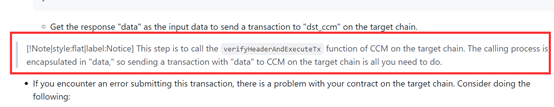
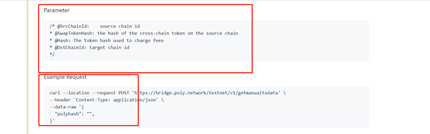
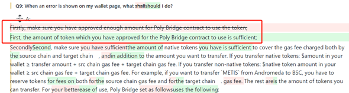
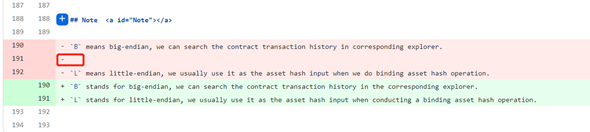
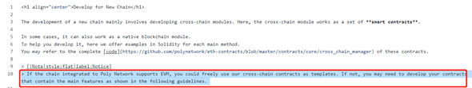
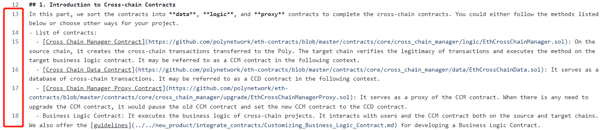
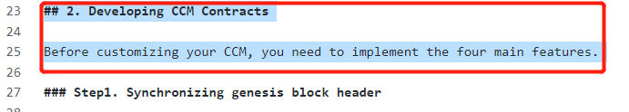

# Docs PR Review

## 1. 已三方Approve，可直接合至主库（谈总）：

    #10，#11，#24，#25

## 2. 存疑or冲突（一男）：

    #7，#12

## 3. 待2.0上线后修改（紫祥）：

    #22，#27，#28

## 4.已线上commit修改（紫祥）：

    #15，#20

## 5.本地修改（一男）：

    #21，#23，#26，#12

### #21

#### （1）位置：大概在代码68行

修改：

\> [!Note|style:flat|label:Notice]

\> This step is to call the `verifyHeaderAndExecuteTx` function of CCM on the target chain. 

\>  The calling process is encapsulated in "data," so you only need to send a transaction with "data" to CCM on the target chain.

#### （2）位置：

修改：

- If you encounter an error submitting this transaction, there is something wrong with your contract on the target chain. Consider the following problems: 

#### （3）位置：

注意检查一下这里的参数，只需要保留Polyhash。

### #23

#### （1）位置：FAQ Q9 

修改：

A: <li>First, make sure the amount of token which you have approved for the Poly Bridge contract to use is sufficient;</li> 

### #26

#### （1）位置：

修改：

Approve后，增加一行 。即，内容按照#26的pr，仅格式修改。 

### #12

#### （1）位置：

修改：

The development of a new chain mainly involves developing cross-chain modules. In chains supporting EVM, the cross-chain module works as a set of **smart contracts**. 

In some cases, it can also work as a native module. 

To help you develop it, here Poly Network team offers examples in Solidity to develop smart contract for each main method.

#### （2）位置：

修改：

> If the chain supports EVM, you could freely use cross-chain contracts provided by Poly Network. If not, you may need to develop your contracts that contain the main features as shown in the following guidelines. 

#### （3）位置：

修改：

In general, cross-chain contracts are sorted into **logic**, **data**, and **proxy** contracts. You could either follow the methods listed below or choose other ways for your project. 

- List of contracts: 
  - [Cross Chain Manager Contract](https://github.com/polynetwork/eth-contracts/blob/master/contracts/core/cross_chain_manager/logic/EthCrossChainManager.sol): It serves as an agent to manage the cross-chain transaction both on the source chain and the target chain. It may be referred to as CCM contract in the following context.

  - [Cross Chain Data Contract](https://github.com/polynetwork/eth-contracts/blob/master/contracts/core/cross_chain_manager/data/EthCrossChainData.sol): It serves as a database of cross-chain transactions. It may be referred to as CCD contract in the following context.

  - [Cross Chain Manager Proxy Contract](https://github.com/polynetwork/eth-contracts/blob/master/contracts/core/cross_chain_manager/upgrade/EthCrossChainManagerProxy.sol): It serves as a proxy of the CCM contract to update the CCM contracts stored in CCD contracts. It may be referred to as CCMP contract in the following context.

  - Business Logic Contract: It executes the business logic of cross-chain projects. It interacts with users and the CCM contract both on the source and target chains. We also offer the [guidelines](../../new_product/integrate_contracts/Customizing_Business_Logic_Contract.md) for developing a Business Logic Contract.

    

#### （4）位置：

修改：

## 2. Developing CCM Module

The following four features are the core functions of CCM contracts and must be implemented. 

#### （5）位置：文档最后面

**增加：**

## 3. Developing CCD Module

As mentioned above, CCD is functioned as storing and catching data of CCM. You can take different methods to realize CCM module for different chains according to your actual needs. In general, Poly Network team deploys the CCD contract separately for the CCD module, but you can also realize the module by deploying an integrated contracts.  See the [source code](https://github.com/polynetwork/eth-contracts/blob/master/contracts/core/cross_chain_manager/data/EthCrossChainData.sol) for the specifics.  

## 4. Developing CCMP Module

CCMP is used to manage CCM. Similar to CCD, CCMP module also has two ways to be implemented. And you can see the [source code](https://github.com/polynetwork/eth-contracts/blob/master/contracts/core/cross_chain_manager/upgrade/EthCrossChainManagerProxy.sol) for the specifics.

